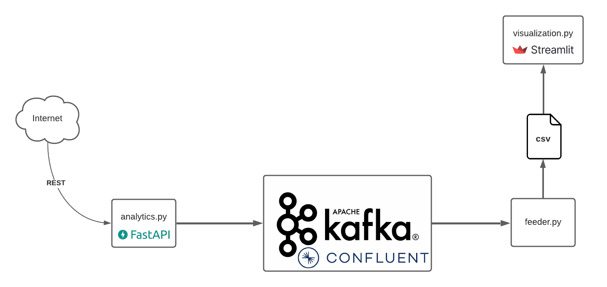

# Brokerlytics

Second exercise for the subject 20_SVE2UE at FH OÖ Campus Hagenberg. The exercise is based on Amazon Managed Streaming for Apache Kafka and uses the kafka-python library for the producers and consumers.

## tl;dr

After implementing the three services I had to find out that the MSK does not expose public endpoints according to their [FAQ](https://aws.amazon.com/msk/faqs/):

> **Q: Is the connection between my clients and an Amazon MSK cluster always private?**
Yes, the only way data can be produced and consumed from an Amazon MSK cluster is over a private connection between your clients in your VPC, and the Amazon MSK cluster. Amazon MSK does not support public endpoints.

There are solutions to bypass this problem ([VPC Peering, Direct Connect, VPN](https://docs.aws.amazon.com/msk/latest/developerguide/client-access.html) or [Elastic IPs](https://repetitive.it/aws-msk-how-to-expose-the-cluster-on-the-public-network/?lang=en)) but these approaches are either too much overhead for such a demo project or not easy to automate. Another downside is that MSK does not support auto-scaling for brokers but only for storage.

To mitigate these challenges the [Confluent](https://www.confluent.io) cloud was used which allows connections through local clients, provides better documentation for client SDKs and also offers the following features:
* Scheme Registry: This registry manages schemas that define how data is structured in Kafka messages.
* ksqlDB: ksqlDB is an event streaming database purpose-built to help developers create stream processing applications on top of Apache Kafka.
* Connectors: Confluent offers pre-built, Kafka Connectors that make it easy to instantly connect to popular data sources and sinks.

## 🚩 Goal

Service that allows producers to send analytics events via Kafka. A producer also provides an interface to receive data from a client applications. However, this aspect is only abstracted in the course of this task. The events sent are then stored by a consumer.
The data stream would look like this: client (iOS, Web, ...) -> producer (Python) -> Kafka -> consumer (Python) -> data store.

## 🏗 Architecture

The initial architecture would have looked like this with producers and consumers running on a local machine. This architecture is also represented as Terraform configuration in the [infrastructure](./infrastructure) folder.


Due to the downsides of AWS MSK the architecture now uses Confluent as provider:



For detailed information about the individual services read the corresponding README.

| Service                                    	| Description                                                                                                                                                	|
|--------------------------------------------	|------------------------------------------------------------------------------------------------------------------------------------------------------------	|
| [analytics](./analytics/README.md)         	| Provides a REST API to start the event simulation or to manually create events. It takes over the producer part an sends the created events to the broker. 	|
| [feeder](./feeder/README.md)               	| Consumes the events from the broker and saves it to a CSV file.                                                                                            	|
| [visualization](./visualization/README.md) 	| Uses the CSV file generated by the `feeder` component and generates a website which visualises the results.                                                	|

## 📝 Requirements

* `terraform`
* `awscli`

## 🚀 Get started

```
make bootstrap
make run
```

## Resume

* **analytics**:
* **feeder**:
* **visualization**:

