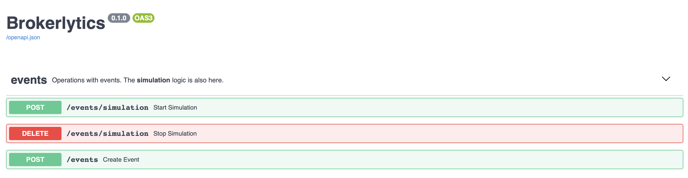
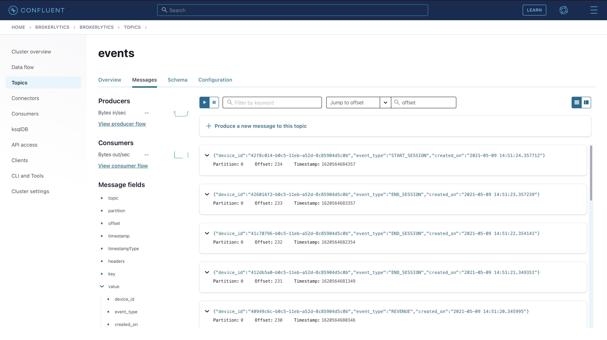

# Analytics

## 🚀 Get Started
```sh
python3 -m venv venv
source venv/bin/activate
pip install -r requirements.txt
uvicorn analytics:app --reload --root-path /api/v1
```

## ✨ Functionality
| Method 	| Route                       	| Description                                                              	|
|--------	|-----------------------------	|--------------------------------------------------------------------------	|
| POST   	| events/simulation?duration= 	| Starts the simulation which will send events in the predefined interval. 	|
| DELETE 	| events/simulation           	| Stops the simulation.                                                    	|
| POST   	| events                      	| Creates a new event which will be sent to the broker                     	|



## 🌐 Confluent



