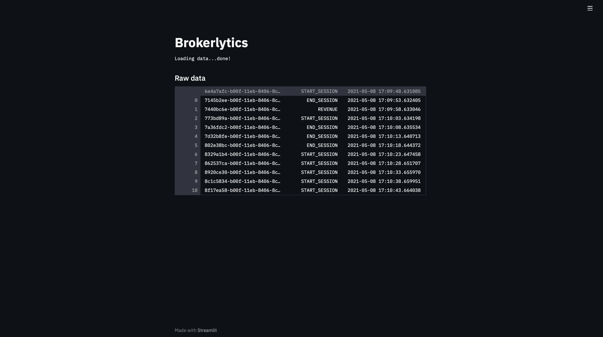

# Feeder

## 🚀 Get Started
```sh
python3 -m venv venv
source venv/bin/activate
pip install -r requirements.txt
streamlit run visualization.py
```

## ✨ Functionality

The visualization module uses the Python Streamlit framework the display collected data of the feeder module. The following screenshot shows the web UI:

